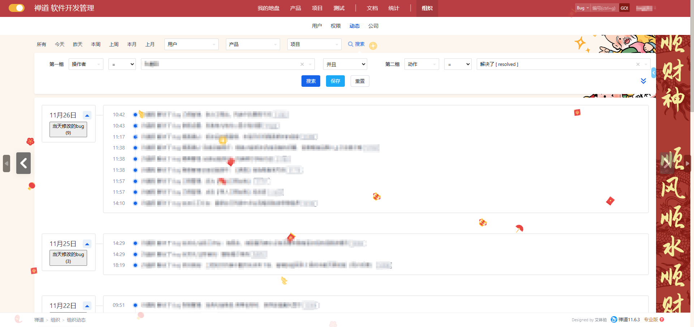
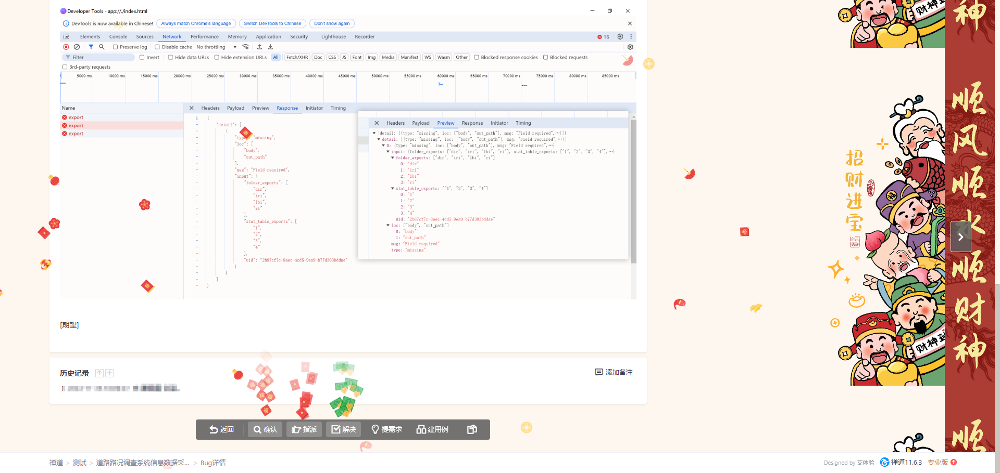

# Copy Zentao BUG

自用禅道油猴脚本

## 功能列表

1. 在动态页面增加复制按钮与数量统计，点击即可将某日bug复制成逗号分隔的文本
2. 增加全局春节背景
3. 增加全局春节主题飘花，可控制开关
4. 增加解决、指派、激活、关闭、确认时的互动特效

## 脚本地址

[https://greasyfork.org/zh-CN/scripts/450772-copy-zentao-bug](https://greasyfork.org/zh-CN/scripts/450772-copy-zentao-bug)

## 功能截图

